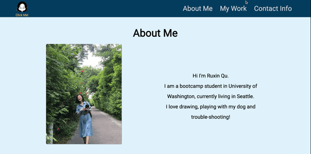

# ruxinqu-portfolio 

## Description
This is my portfolio. 
It contains:
* Introduction 
* Links to my previous projects 
* My contact information. 

View my portfolio: https://ruxinqu.github.io/ruxinqu-portfolio/

## Usage
1. The navigation at the top contains links to About Me section, My Work section and Contact Info section.
2. Images and links to the deployed websites of my previous projects are provided in My Work section.
3. A little game at the top left page is made to add some fun!
4. The website is responsive to different screen sizes.
5. The following animation shows the website's appearance and functionality on **PC**: 

6. The following animation shows the website's apperance on **Tablet** and **Mobile**:

## Sources Referenced

Google | https://www.embed-map.com |MDN web docs | W3schools online web tutorials | Codecademy 
